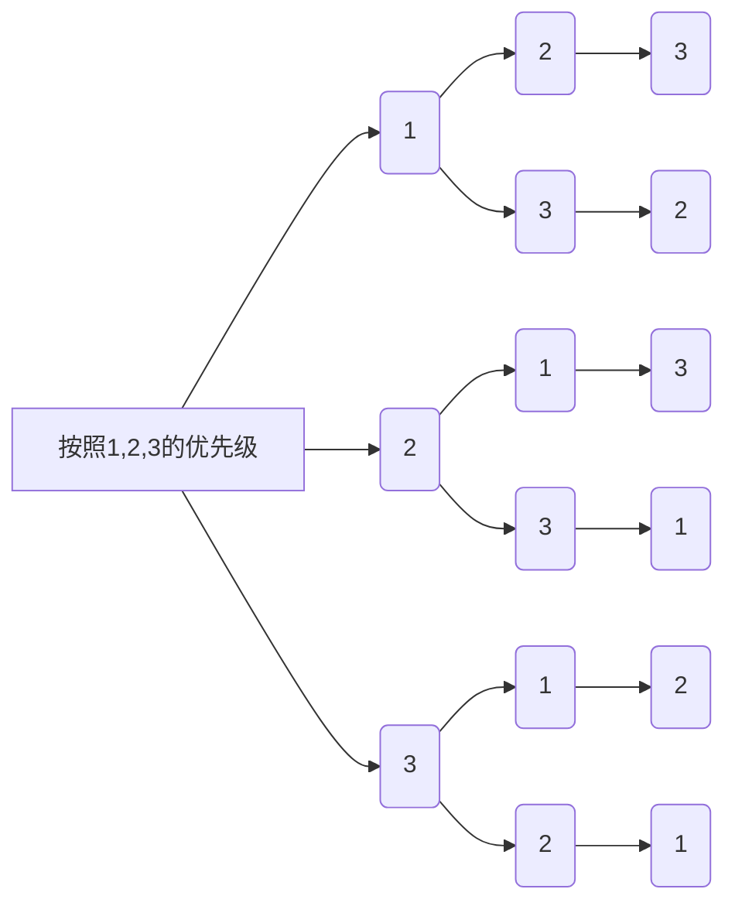

## 四.万能的搜索

### 1.深度优先搜索

**例题**：有扑克牌,编号为`1 2 3`,以及盒子,编号为`1 2 3 `,如下图所示

|     箱子编号     |   1   |   2    |   3   |
| :--------------: | :---: | :----: | :---: |
| 只能放一张扑克牌 | first | second | third |

**顺序**:按照`1 2 3 `的次序来

|  箱子编号  |  1   |  2   |  3   |
| :--------: | :--: | :--: | :--: |
| 扑克牌编号 |  1   |  2   |  3   |
| 扑克牌编号 |  1   |  3   |  2   |
| 扑克牌编号 |  2   |  1   |  3   |
| 扑克牌编号 |  2   |  3   |  1   |
| 扑克牌编号 |  3   |  1   |  2   |
| 扑克牌编号 |  3   |  2   |  1   |



**代码步骤**:

* `a[]`表示小盒子

* `step`表示已经到了第几个盒子面前

* `book[]`表示标记

* ```c
  #include<stdio.h>
  #include<stdlib.h>
  #define USED 1
  #define UNUSED 0
  int a[10],book[10],n;
  //全局变量默认为0，不需要初始化
  
  /*
  a[],盒子
  book[],给用过的扑克牌上标记
  n个数全排列
  */
  
  int dfs(int step)
  {
      if (step==n+1)//说明已经放完了
      {
          //输出
          for(int i=1;i<=n;i++)
          {
              printf("%d ",a[i]);
          }
          printf("\n");
  
          return;//结束这个函数的使命
      }
      //从第step个盒子开始
      for (int i = 1; i <= n; i++)//按照1，2，3的优先级
      {
          if (book[i]==UNUSED)//如果没有标记过，说明没有使用
          {
              a[step]=i;//将扑克牌放入盒子里
              book[i]=USED;//放入盒子的牌进行标记，说明不在手里了
              dfs(step+1);//到第二个盒子
              book[i]=0;//把标记清零
          } 
          else continue;//标记过了看下一个i
      }
  }
  int main()
  {
      scanf("%d",&n);
      dfs(1);
      return 0;
  }
  ```

* **分析**

  ```mermaid
  graph TB
  a[dfs 1]-.-b(如果走完了三个盒子,打印,中止函数)-.-c(循环,i=1->2->3)-.-d(把i放进盒子a,并标记i)-.-e(dfs 2)-.-f(去除标记)--遍历三次-->c
  g[dfs 2]-.-h(如果走完了三个盒子,打印,中止函数)-.-i(循环,i=1->2->3)-.-j(把i放进盒子a,并标记i)-.-k(dfs 3)-.-l(去除标记)--遍历三次-->i
  m[dfs 3]-.-n(如果走完了三个盒子,打印,中止函数)-.-u(循环,i=1->2->3)-.-p(把i放进盒子a,并标记i)-.-s(dfs 4)-.-t(去除标记)--遍历三次-->u
  q[dfs 4]-.-r(如果走完了三个盒子,打印,中止函数,step为4时中止)
  e-->g
  k-->m
  s-->q
  ```
