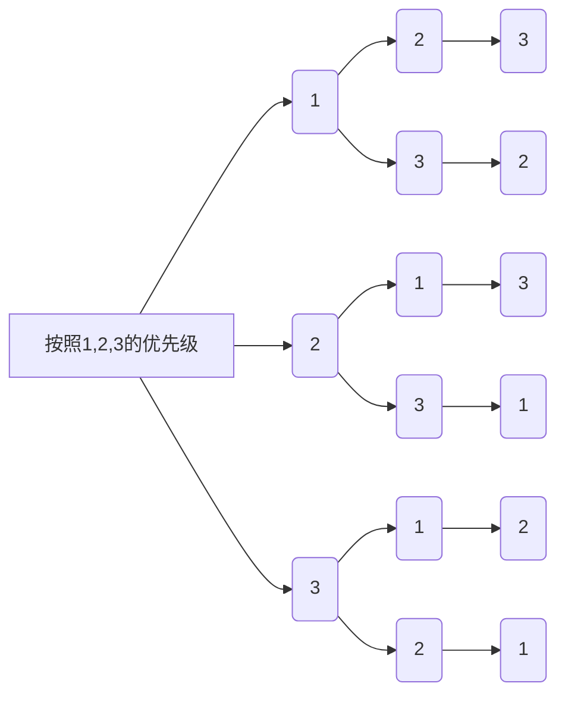
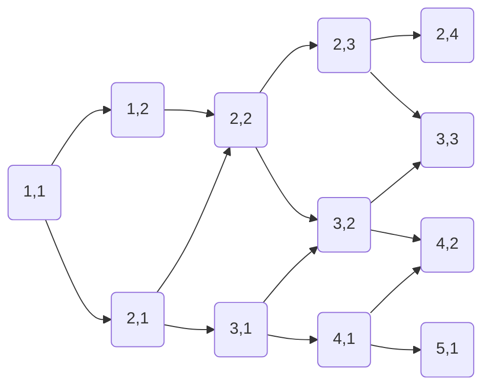

## 四.万能的搜索

### 1.深度优先搜索

**例题**：有扑克牌,编号为`1 2 3`,以及盒子,编号为`1 2 3 `,如下图所示

|     箱子编号     |   1   |   2    |   3   |
| :--------------: | :---: | :----: | :---: |
| 只能放一张扑克牌 | first | second | third |

**顺序**:按照`1 2 3 `的次序来

|  箱子编号  |  1   |  2   |  3   |
| :--------: | :--: | :--: | :--: |
| 扑克牌编号 |  1   |  2   |  3   |
| 扑克牌编号 |  1   |  3   |  2   |
| 扑克牌编号 |  2   |  1   |  3   |
| 扑克牌编号 |  2   |  3   |  1   |
| 扑克牌编号 |  3   |  1   |  2   |
| 扑克牌编号 |  3   |  2   |  1   |



**代码步骤**:

* `a[]`表示小盒子

* `step`表示已经到了第几个盒子面前

* `book[]`表示标记

* ```c
  #include<stdio.h>
  #include<stdlib.h>
  #define USED 1
  #define UNUSED 0
  int a[10],book[10],n;
  //全局变量默认为0，不需要初始化
  
  /*
  a[],盒子
  book[],给用过的扑克牌上标记
  n个数全排列
  */
  
  int dfs(int step)
  {
      if (step==n+1)//说明已经放完了
      {
          //输出
          for(int i=1;i<=n;i++)
          {
              printf("%d ",a[i]);
          }
          printf("\n");
  
          return;//结束这个函数的使命
      }
      //从第step个盒子开始
      for (int i = 1; i <= n; i++)//按照1，2，3的优先级
      {
          if (book[i]==UNUSED)//如果没有标记过，说明没有使用
          {
              a[step]=i;//将扑克牌放入盒子里
              book[i]=USED;//放入盒子的牌进行标记，说明不在手里了
              dfs(step+1);//到第二个盒子
              book[i]=0;//把标记清零
          } 
          else continue;//标记过了看下一个i
      }
  }
  int main()
  {
      scanf("%d",&n);
      dfs(1);
      return 0;
  }
  ```

* **分析**

  ```mermaid
  graph TB
  a[dfs 1]-.-b(如果走完了三个盒子,打印,中止函数)-.-c(循环,i=1->2->3)-.-d(把i放进盒子a,并标记i)-.-e(dfs 2)-.-f(去除标记)--遍历三次-->c
  g[dfs 2]-.-h(如果走完了三个盒子,打印,中止函数)-.-i(循环,i=1->2->3)-.-j(把i放进盒子a,并标记i)-.-k(dfs 3)-.-l(去除标记)--遍历三次-->i
  m[dfs 3]-.-n(如果走完了三个盒子,打印,中止函数)-.-u(循环,i=1->2->3)-.-p(把i放进盒子a,并标记i)-.-s(dfs 4)-.-t(去除标记)--遍历三次-->u
  q[dfs 4]-.-r(如果走完了三个盒子,打印,中止函数,step为4时中止)
  e-->g
  k-->m
  s-->q
  ```
**广度优先搜索方法**:



**如图所示**:像这样找到`4,3`,计算**箭头数**即可

* 用**队列**模拟

* **具体代码**

  ```c
  #include<stdio.h>
  
  struct note
  {
      int x;//横坐标
      int y;//纵坐标
      int s;//步数
  };
  int main()
  {
      struct note que[2501];
      //表示扩展
      int a[51][51]={0};//地图
      int book[51][51]={0};//标记
  
      int next[4][2]=//四个含有两个元素的一维数组
      {
        //右    下     左     上
        {0,1},{1,0},{0,-1},{-1,0}
      };
  
      int head,tail;//队列，队尾
  
      int n,m;
      scanf("%d %d",&n,&m);//定义一个n*m的矩阵
      //输入迷宫
      for (int i = 1; i <= n; i++)
      {
          for (int j = 1; j <= m; j++)
          {
              scanf("%d",&a[i][j]);
          }    
      }
      //读入起始点，中止点
      int start_x,start_y;
      int p,q;
      scanf("%d %d %d %d",&start_x,&start_y,&p,&q);
  
      //队列初始化
      head=1;
      tail=1;
      //插入迷宫A的坐标
      que[tail].x=start_x;
      que[tail].y=start_y;
      que[tail].s=0;//现在一步还没走呢
      tail++;//tail指向2
      book[start_x][start_y]=1;//做标记
  
      int flag=0;//用来标记是否到达目的地
  
      int tx,ty;
      //当队列不为空
      while (head<tail)
      {
          //枚举四个方向
          for (int k = 0; k <= 3; k++)
          {
              //计算下一个点的坐标
              tx=que[head].x+next[k][0];
              ty=que[head].y+next[k][1];
  
              //是否越界
              if(tx<1||tx>n||ty<1||ty>m)
               continue;
  
              //不是障碍物并且没有标记过
              if(a[tx][ty]==0&&book[tx][ty]==0)
              {
                book[tx][ty]=1;//标记
                //将新的插入队列的末尾
                que[tail].x=tx;
                que[tail].y=ty;
                que[tail].s=que[head].s+1;//步数+1
                tail++;//tail向后
              }
  
              //如果到目的地了
              if (tx==p&&ty==q)
              {
                  flag=1;
                  goto end_while;//跳出所有循环
              }
          }
          head++;
      }
      //输出步数
      end_while:
      printf("%d",que[tail-1].s);
      return 0;
  }
  ```

* **流程表**
  
  | que  |     1     |  2   |  3   |  4   |
  | :--: | :-------: | :--: | :--: | :--: |
  |      | head/tail |      |      |      |
  |  x   |     1     |      |      |      |
  |  y   |     1     |      |      |      |
  |  s   |     0     |      |      |      |
  |      |   head    | tail |      |      |
  |  x   |     1     |      |      |      |
  |  y   |     1     |      |      |      |
  |  s   |     0     |      |      |      |
  |      |   head    | tail |      |      |
  |  x   |     1     |  1   |      |      |
  |  y   |     1     |  2   |      |      |
  |  s   |     0     |  1   |      |      |
  |      |   head    |      | tail |      |
  |  x   |     1     |  1   |      |      |
  |  y   |     1     |  2   |      |      |
  |  s   |     0     |  1   |      |      |
  |      |   head    |      | tail |      |
  |  x   |     1     |  1   |  2   |      |
  |  y   |     1     |  2   |  1   |      |
  |  s   |     0     |  1   |  1   |      |
  |      |   head    |      |      | tail |
  |  x   |     1     |  1   |  2   |      |
  |  y   |     1     |  2   |  1   |      |
  |  s   |     0     |  1   |  1   |      |
  |      |           | head |      | tail |
  |  x   |     1     |  1   |  2   |      |
  |  y   |     1     |  2   |  1   |      |
  |  s   |     0     |  1   |  1   |      |
